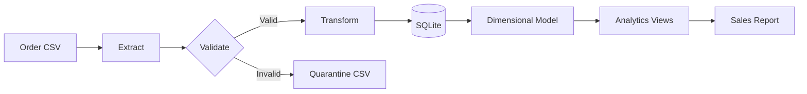

# Northwind Outfitters Retail Analytics Platform

[](https://github.com/j-watterson/retail-analytics-platform/actions/workflows/ci.yml)
[](https://www.python.org/)
[](LICENSE)

## 1. Executive Summary

Northwind Outfitters relied on manually generated sales reports assembled from
order exports. Reporting was slow, transformations were inconsistent, and bad
records could silently distort key metrics.

This project replaces that process with an automated, production-style ETL
pipeline. It extracts retail orders from CSV, validates their schema and
business rules, quarantines invalid records, builds a dimensional SQLite
warehouse, and publishes reusable analytics views for sales reporting.

## 2. Business Value

The platform gives operations and merchandising teams a consistent source for
daily revenue, category performance, and customer value. It reduces manual
report preparation, makes data quality failures visible, and creates a
foundation that later Northwind projects can orchestrate and migrate to the
cloud.

Key outcomes:

- repeatable reporting instead of spreadsheet transformations;
- traceable loads with row counts, statuses, and source checksums;
- consistent metric definitions in version-controlled SQL;
- rejected data isolated for correction instead of silently accepted.

## 3. Architecture



The pipeline uses a star schema with `fact_orders`, `dim_customers`, and
`dim_products`. See [the architecture document](docs/architecture.md) for the
data model, reliability controls, and design tradeoffs.

## 4. Technology Stack

- Python 3.12 and its standard library for ETL, validation, logging, and CLI;
- SQL and SQLite for the analytical warehouse and metric views;
- Docker and Docker Compose for reproducible execution;
- GitHub Actions for automated tests, smoke tests, and image builds;
- `unittest` for dependency-free unit and integration tests.

## 5. Data Flow

1. **Extract:** Read a configured CSV source and calculate its SHA-256 checksum.
2. **Validate:** Enforce required columns, types, allowed statuses, positive
   quantities, non-negative prices, timestamps, and email shape.
3. **Quarantine:** Write invalid records and their reasons to a rejection file.
4. **Transform:** Normalize values, calculate gross revenue, and resolve
   customer and product surrogate keys.
5. **Load:** Upsert dimensions and facts inside a transaction.
6. **Audit:** Record run status, timestamps, checksum, and row counts.
7. **Consume:** Query daily sales, category performance, and customer lifetime
   value through version-controlled SQL views.

## 6. Engineering Decisions

| Decision | Rationale and tradeoff |
| --- | --- |
| SQLite warehouse | Makes the project fully local, inexpensive, and easy to review. It trades away distributed scale and high write concurrency. |
| Dimensional model | Gives analysts stable, understandable facts and dimensions while mirroring a design that can move to BigQuery. |
| Standard-library pipeline | Removes dependency and credential friction for reviewers. A production deployment could use a dataframe or distributed engine at larger volume. |
| Checksum plus upserts | Skips identical completed sources while allowing corrected orders to be replayed safely with `--force`. |
| Row quarantine | Preserves valid business data when individual rows fail, while a missing source contract fails the entire batch. |
| SQL views for metrics | Centralizes definitions and avoids reproducing business logic in reports. |

## 7. Production Features

- Incremental, idempotent natural-key upserts
- Source checksum deduplication
- Transactional warehouse loads
- Batch-level and row-level validation
- Rejected-row quarantine with reasons
- Structured timestamped logging
- External JSON configuration
- ETL run audit table
- Indexed fact table
- Automated unit and integration tests
- Non-root Docker image
- CI test, smoke-test, and container-build workflow

## Quick Start

Requirements: Python 3.11+.

```bash
git clone https://github.com/j-watterson/retail-analytics-platform.git
cd retail-analytics-platform
make test
make run
```

Expected sample output:

```text
status=completed read=12 loaded=12 rejected=0

Northwind Outfitters — Sales Summary
=====================================
Completed orders: 10
Units sold:       17
Revenue:         $1,038.98
```

The second unchanged run returns `status=skipped`, demonstrating source-level
idempotency. Use `make clean` to reset local generated data.

### Run with Docker

```bash
docker compose run --rm etl
```

### Configure the Pipeline

Edit `configs/pipeline.json` or supply another file:

```bash
PYTHONPATH=src python -m retail_analytics --config path/to/config.json --report
```

See the [operations runbook](docs/runbook.md) for reprocessing, recovery, and
useful queries.

## Repository Structure

```text
.
├── .github/workflows/ci.yml
├── configs/pipeline.json
├── data/raw/orders.csv
├── docs/
│   ├── architecture.md
│   └── runbook.md
├── scripts/
├── sql/
│   ├── analytics_views.sql
│   └── schema.sql
├── src/retail_analytics/
├── tests/
├── Dockerfile
├── Makefile
├── compose.yaml
└── pyproject.toml
```

## 8. Scalability

For larger production volumes, files would land in object storage and be
partitioned by ingestion date. Loads would process only new partitions, and
the SQLite warehouse would move to BigQuery with date partitioning and customer
or product clustering. Multiple files could then be validated in parallel,
while orchestration would manage retries, backfills, alerts, and service-level
objectives.

The next portfolio repository, the
[Customer Analytics Warehouse](https://github.com/j-watterson/customer-analytics-warehouse),
is the natural evolution of this design.

## 9. Future Improvements

- Migrate warehouse models to BigQuery and dbt.
- Replace local files with object-storage ingestion and event manifests.
- Add schema evolution and freshness checks.
- Orchestrate scheduled loads with Airflow.
- Publish metrics to a BI dashboard.
- Add alerting, lineage, and operational service-level objectives.
- Manage secrets and infrastructure through a cloud secrets manager and
  Terraform.

## 10. Interview Talking Points

- **Business problem:** Manual retail reporting was slow, inconsistent, and
  unable to surface data quality failures.
- **Architecture:** Configured CSV ingestion feeds validation, quarantine,
  dimensional transformation, transactional loading, and analytics views.
- **Biggest challenge:** Balancing strict quality controls with the need to load
  valid orders when only some records are bad.
- **Key tradeoff:** SQLite maximizes portability and reviewability but is not the
  final platform for distributed workloads.
- **Why this design:** It demonstrates production controls with minimal setup
  and creates a clean migration path to the next BigQuery project.
- **Production improvements:** Object storage, orchestration, monitoring,
  secrets management, cloud warehousing, and infrastructure as code.
- **Engineering lesson:** A useful pipeline is more than transformation code;
  it needs contracts, auditability, replay safety, and documented operations.
