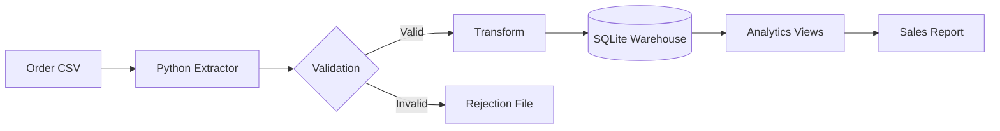
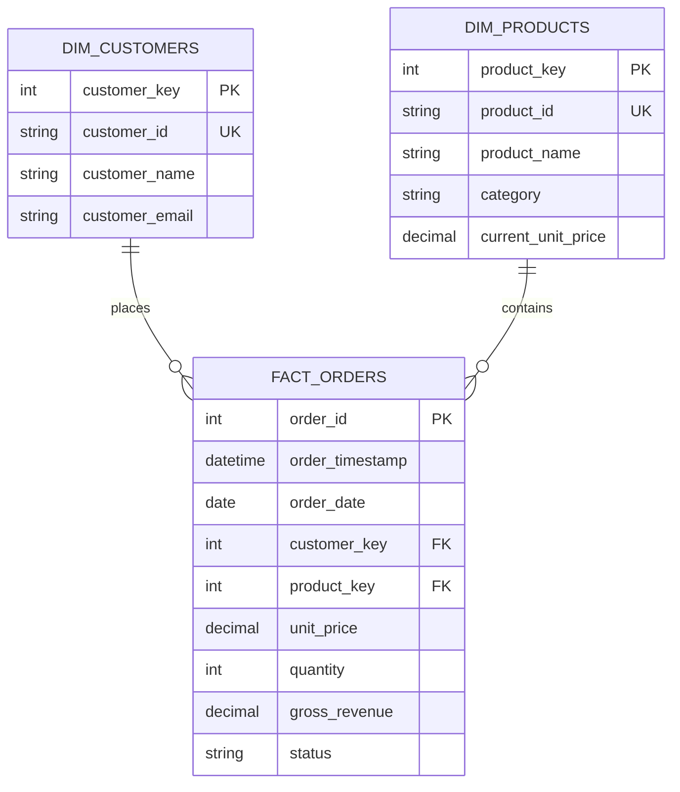

# Architecture

## System Context

The Retail Analytics Platform is the first component in Northwind Outfitters'
data platform. It replaces spreadsheet-based sales reporting with a repeatable
batch process and a queryable analytical model.

## Warehouse Model

## Reliability Design

- **Idempotency:** Natural-key upserts prevent duplicate facts. A SHA-256 source
  checksum skips files that have already completed successfully.
- **Atomicity:** Valid dimension and fact records are loaded in a transaction.
- **Auditability:** `etl_runs` stores source, checksum, timestamps, status, row
  counts, and errors for every attempted load.
- **Data quality:** Header checks fail the batch when the contract is wrong.
  Row-level rule failures are written to a rejection file for investigation.
- **Reproducibility:** The same CLI runs locally, in CI, and inside Docker.

## Tradeoffs

SQLite keeps this portfolio project inexpensive, portable, and runnable without
cloud credentials. It is not intended for high write concurrency or large-scale
distributed workloads. The SQL and dimensional design create a straightforward
migration path to BigQuery, the planned warehouse in the next portfolio project.

